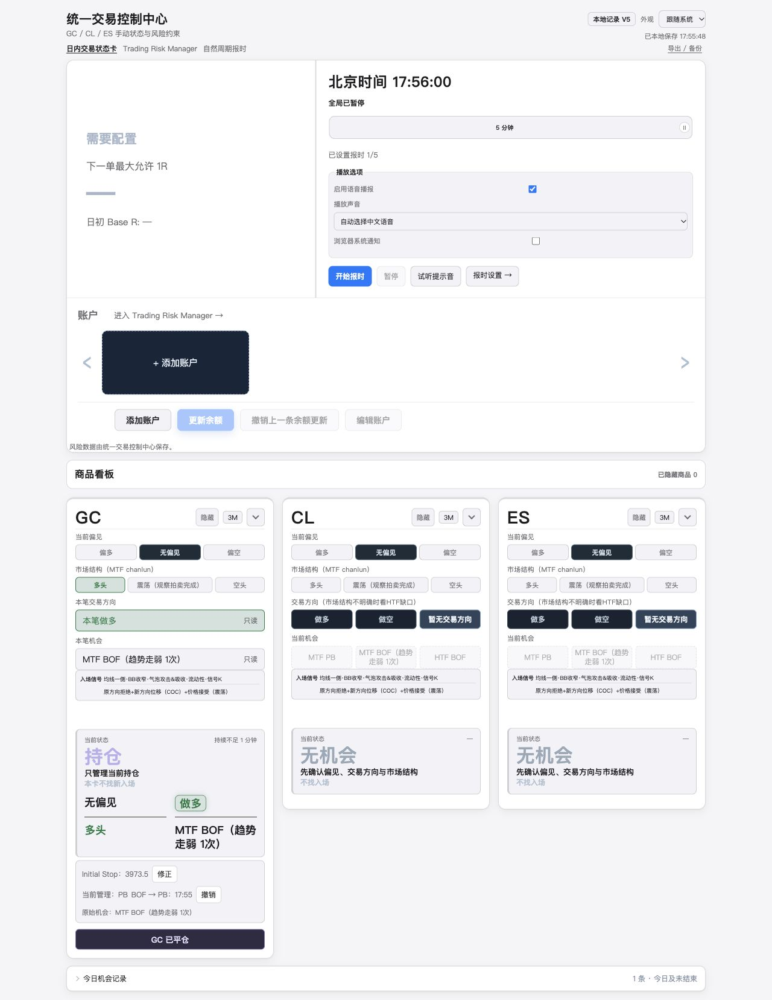
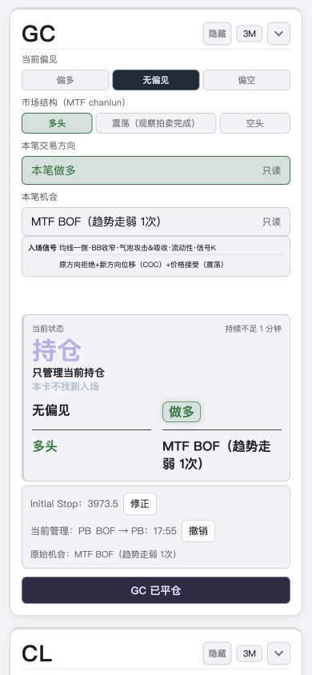
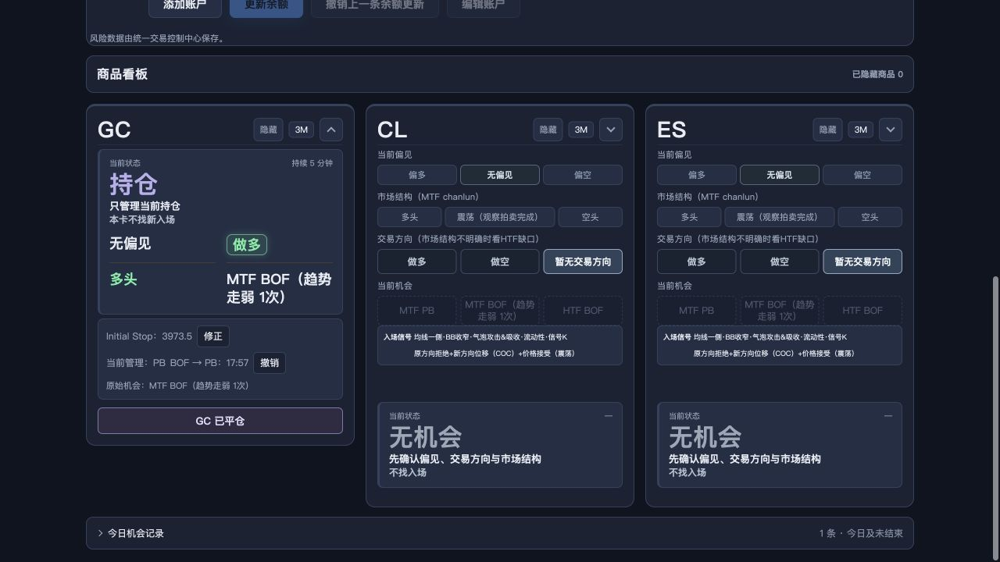

# Exit Research V0 / Step 1 — 中文执行与测试报告

日期：2026-10-04（Asia/Shanghai）。
仓库：xhb-D/intraday-task-cards。
开发分支：codex/exit-research-v0-step1。
基线：e25ba69a1b264b311e51101eb3d282ca59b632a0。
状态：开发分支实现完成，等待人工验收；未上线，未 FROZEN。
交付 commit SHA 以最终回复和 git rev-parse HEAD 为准，避免在 commit 自身中形成自引用。

## 实际文件范围

| 文件 | 修改目的 |
| --- | --- |
| src/model.js | V5、分离 V3/V4/V5 校验及迁移、事件追加与推导 API |
| src/persistence.js | V3/V4 内嵌 envelope 迁移和 Markdown 人类摘要 |
| src/unified-persistence.js | Unified V2 内嵌旧日内迁移；复用启动事务 |
| src/app.js | 持仓录入、修正、单击转换/撤销、版本提示 |
| refinement.css | 一小块 Capture 的主题、窄屏及焦点样式 |
| index.html | V5 标签和所有现有资源的一致本地版本参数 |
| dist/app.bundle.js | 按既有 build 脚本生成 |
| test/research-capture.test.js | 33 项模型、迁移、持久化和异常测试 |
| test/research-capture-ui.test.js | 7 项生产 bundle 交互测试 |
| test/model.test.js / migration-v3.test.js / unified-persistence.test.js | 保留原测试，只更新当前版本断言 |
| test/bundle.test.js | 更新资源版本断言，继续验证八个资源一致 |
| test/fixtures/compatibility/golden-fixtures.js | 固定历史空白 fixture 为原 V4，原 manifest/hash 未改 |
| docs/EXIT_RESEARCH_STEP1_SPEC.md | 本轮业务/技术范围补充 |
| docs/UNIFIED_BUSINESS_SPEC.md / UNIFIED_ARCHITECTURE_SPEC.md | 增加补充规范链接，保留旧基线正文 |
| docs/EXIT_RESEARCH_STEP1_REPORT.md | 本执行及验收报告 |
| qa/exit-research-step1/*.jpg / npm-test.log | 本地合成数据 UI 截图及实际测试输出 |

未修改 router、风险管理器或自然报时实现、package.json、构建脚本、部署配置；未创建 src/exit-research/。

## V5 和 Manual Event 最终结构

统一顶层 schemaVersion 为 2，sections.intraday.schemaVersion 与其 state.schemaVersion 均为 5。
其余日内字段保留；每笔 Opportunity 和 Record 新增 researchCapture：

```json
{
  "eventSequence": 2,
  "manualEvents": [
    {
      "id": "op-1-example:manual-1",
      "type": "INITIAL_STOP_RECORDED",
      "recordedAt": 1790000000000,
      "effectiveAt": 1790000000000,
      "source": "manual_intraday",
      "payload": { "stopPrice": 3974 }
    },
    {
      "id": "op-1-example:manual-2",
      "type": "INITIAL_STOP_CORRECTED",
      "recordedAt": 1790000001000,
      "effectiveAt": 1790000001000,
      "source": "manual_intraday",
      "payload": { "oldValue": 3974, "newValue": 3973.5 }
    }
  ]
}
```

支持五个规定类型。转换 payload 为 from/to；撤销另含 revertedEventId。
ID 在单笔机会内按序号唯一，导入导出保持原值。修正/撤销均只追加。
无 Initial Stop 或 currentManagementState 永久 truth 字段；当前值由事件推导。

## 实际迁移链

- V3：assertLegacyState → migrateV3Workspace → assertV4State。
- V4：assertV4State → migrateV4Workspace → assertState(V5)。
- envelope 的 migrateEnvelope 编排上述确定性链；V5 输入不再迁移。
- V3 → V4 保留原分类升级语义，旧活动机会以 rules_upgrade 收尾；audit 的 toSchemaVersion 保持 4。
- V4 → V5 只增加空 capture，不改变 ID、symbol、direction、type、registeredAt、enteredAt、endedAt、stages、reason、bias/structure snapshot 等原有交易字段。
- Unified V2 + Intraday V4/V3 可迁移到 Unified V2 + Intraday V5；Unified V1 旧顶层迁移继续通过。
- 本地 V2 迁移保存原始 pre-upgrade 快照，经 raw guard 一次写 canonical、顶层 revision 加一并回读；失败保留/回滚原始内容，不读 legacy chime。
- 迁移幂等，不追加人工事件，不重复追加 V3 分类升级 audit。

## 实际交互

Initial Stop 仅在持仓显示“待记录”和价格输入。首次记录后显示价格和“修正”，修正时预填当前值，保存后追加 oldValue/newValue 事件；可取消编辑。空值、非有限数字、0 和负数被拒绝；不校验 Entry 相对位置或 tick size。未填不会阻止平仓。

仅原始 BOF 持仓显示“当前管理：BOF”和 BOF → PB。单击立即记录，显示 PB、变化时间、原始机会和“撤销”；无第二确认。重复转换无副作用。撤销追加 REVERTED，保留原转换，恢复 BOF；允许误触撤销后重新记录。mtf_pb 持仓不显示转换控件。原 htf_pb/htf_bof key 和 type 完全保留。

平仓仍通过既有确认流程；recordSnapshot/syncRecord 复制完整 capture 进入历史。完整统一 JSON 保留所有 IDs、时间、source 和 payload。Markdown 仅显示当前 Stop、已修正标记和有效 BOF → PB 时间；撤销后的转换不作为当前有效变化输出。

## 测试结果

基线 npm test：252/252，通过。
最终 npm test：292/292，通过，0 failed、0 skipped、0 cancelled；原有 252 项全部保留，新增 40 项。

| 验证 | 结果 |
| --- | --- |
| npm test | PASS，292/292 |
| npm run build | PASS，exit 0 |
| node --check dist/app.bundle.js | PASS |
| git diff --check | PASS |
| 构建 top-level symbol integrity | PASS，build 和既有自动测试均覆盖 |
| 历史 golden fixture manifest/hash | PASS，manifest 字节未修改 |
| 新鲜构建与已提交 bundle 比较 | PASS |
| 风险/报时、隔离卡片、生命周期、折叠隐藏、导出/导入和 conflict 回归 | 既有全套自动测试通过 |

完整测试输出：[npm-test.log](../qa/exit-research-step1/npm-test.log)。

仓库没有额外独立 QA/integrity npm script；test:coverage 与 test 同为 node --test，无重复运行必要；build 内置重复符号检查。没有安装任何依赖。

自动覆盖包括：新建 V5、V4 原字段深比较、V3 分段链与历史、迁移幂等、V1/V2 内嵌迁移、启动快照与冲突/回滚、非持仓拒绝、非法价格、首次及补记/修正、事件 ID 和旧值校验、BOF 两类机会、PB 拒绝、重复/撤销、平仓保留、删除不复活、GC/CL/ES 隔离、完整 JSON 往返、Markdown 摘要与生产 bundle 点击锁定。

## 浏览器验证

仅使用新本地 origin：http://127.0.0.1:4196/#/home；合成 GC 机会，无真实订单或客户数据；未打开或修改线上 origin/localStorage。

- 1280×720 桌面与 390×844 窄屏检查；新增 Capture 区无横向溢出，窄屏修正输入区 clientWidth/scrollWidth 均为 334。
- 实际点击登记、入场确认、零值拒绝、Stop 首次记录和修正、单击转换、撤销后重录均正常。
- 深浅主题、折叠、隐藏/恢复与刷新后 Stop/管理事件保留正常。
- 风险和报时设置路由可打开并返回；未触发实际音频/通知授权或券商行为。
- 真实第二标签页检测到第一页面事件写入后显示“检测到外部修改 · 当前页面只读”；生产 bundle 自动测试进一步验证锁定后 submit/转换/撤销/旧平仓确认不能写入。
- 本地预览控制台检查未返回 error/warn。
- 浏览器真实 JSON 下载/上传没有额外手工演练；完整 JSON 的 normalizeImport → commit → load → export 往返已经自动深比较验证。

桌面：



窄屏持仓卡：



最终本地预览：



## 偏离、限制及部署

没有功能范围偏离或重大阻塞。实现轻量 Undo；LATE 类型通过明确 effectiveAt 的模型 API 支持，V0 首页未新增回填时间控件。资源参数全部一致更新是为了保持既有八资源一致性约束，不是正式发布。

本轮仅在 e25ba69 派生的独立工作区/分支开发并本地提交。原稳定 main 和本地 origin/main 仍为 e25ba69；不执行 push、merge 或 Pages 配置变更。因此开发 commit 未部署到 GitHub Pages，本轮未触发正式部署。没有把历史部署证据当成本轮部署证明。

等待人工验收，不继续 Step 2、Tradovate CSV 或 Replay Engine。
